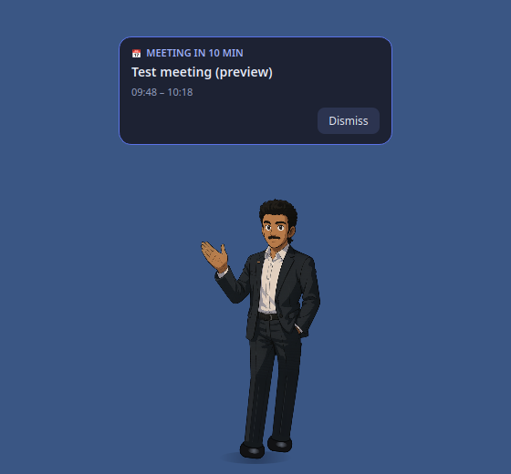
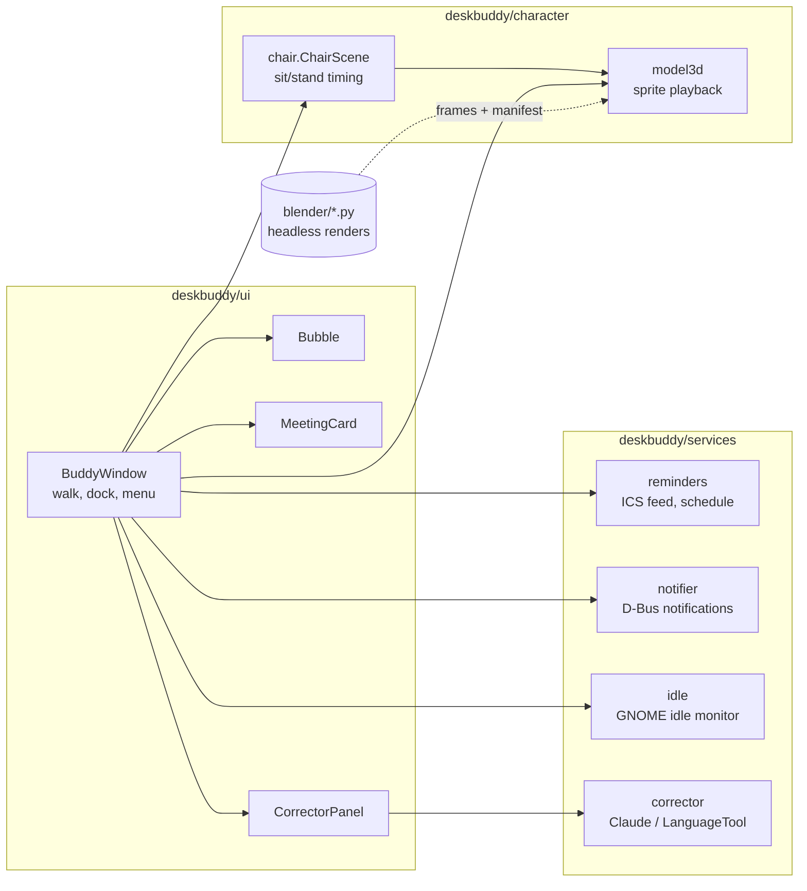

# Desktop Buddy

A small, always-on-top animated character companion for Linux, with paragraph correction,
hourly wellness reminders, and Outlook meeting reminders delivered as real desktop
notifications.

## Start

```bash
./setup.sh
./run.sh
```

### Runs automatically in the background

`./setup.sh --autostart` installs Buddy as a **systemd user service**
(`~/.config/systemd/user/desktop-buddy.service`, a copy of `desktop-buddy.service` here):

- starts automatically every time you log in, with no terminal needed
- restarts itself within 5 seconds if it ever crashes, or if the display isn't ready yet
  at login
- **right-click → Quit** stops it until your next login (or `./run.sh`)

This is already installed and enabled on this laptop.

| Task | Command |
|---|---|
| Start / restart | `./run.sh` (or `systemctl --user restart desktop-buddy`) |
| Stop | right-click → Quit, or `systemctl --user stop desktop-buddy` |
| Check it's running | `systemctl --user status desktop-buddy` |
| See its log / errors | `journalctl --user -u desktop-buddy -f` |
| Turn off autostart | `systemctl --user disable --now desktop-buddy` |

After editing the code, run `./run.sh` to restart with the changes.

## Character and controls

Buddy is a rigged, toon-shaded **3D model built in Blender** from `assets/Hero_image.png`:
side-swept black hair, moustache, light beard, broad shoulders, dark suit, open-collar
white shirt, belt and dress shoes. The app plays frames pre-rendered from it: a 16-frame
walk and an idle pose at 7 turn angles, a 12-frame wave at 5 angles, and the chair sequence.


Only the character's own pixels catch the mouse: clicks on the empty space around him go to
the window underneath.

- **Click:** open the paragraph correction panel.
- **Right-click → Keep on right side:** enabled by default. Buddy stays at the
  bottom right of the primary screen's usable area, above the taskbar, taking
  occasional small steps within 36 pixels of the right edge.
- Turn docking off to let Buddy walk across the screen and enable dragging.
- **Stay here / Resume walking:** pause or resume roaming. Docking takes priority.
- **Hourly water + movement reminders:** enabled by default. Every hour, Buddy waves and
  asks you to drink water, stand, stretch, and walk. **Preview wellness reminder** shows one now.
- Reminders wait while the correction panel is open and appear one at a time.
- Docking and wellness preferences persist across restarts.

### Taking a seat

If you don't click him for **10 minutes**, he pulls up a wooden chair from his right, drags
it behind him and sits down, looking around now and then. Any click, a reminder, or you
coming back to the computer makes him stand up and push the chair away (a left click still
opens the correction panel). To see it sooner: `BUDDY_SIT_AFTER=30 .venv/bin/python buddy.py`.

### Knowing when you're away

Buddy asks GNOME's idle monitor (`org.gnome.Mutter.IdleMonitor`) how long it's been since
you last used the keyboard or mouse, in *any* app. After **5 minutes** idle you count as
away: hourly break reminders are held back (no nagging an empty desk). When you come back
he gets up, says *"Welcome back! You were away 23 min."*, and since that was a break, the
next wellness reminder is an hour from then. Tune with `BUDDY_AWAY_AFTER` (seconds).

### Changing the model

Edit `blender/build_model.py` (geometry, colours, rig) or `blender/render_frames.py`
(poses). Then, in Blender's Python console:

```python
base = "/path/to/desktop-buddy/blender/"
exec(open(base + "build_model.py").read())          # rebuilds the BuddyModel collection
rf = {}; exec(open(base + "render_frames.py").read(), rf)
rf["OUT_DIR"] = "/tmp/buddy_frames"; rf["render"](rf["jobs"]())   # ~2 min
```

and run `.venv/bin/python blender/pack_frames.py /tmp/buddy_frames` to rebuild
`assets/model3d/`. The chair and sitting frames come from `blender/sit_frames.py`, which
builds the chair and renders pull / sit / seated at the idle angle, plus the chair as its own
layer that the app slides and fades behind him. It runs headless (~1 min):

```bash
BUDDY_FRAMES=/tmp/buddy_sit blender -b blender/buddy_model.blend --python blender/sit_frames.py
.venv/bin/python blender/pack_frames.py /tmp/buddy_sit    # merges into the existing manifest
```

## Outlook meeting reminders

In Outlook on the web, open **Settings → Calendar → Shared calendars → Publish
 a calendar**, and copy the **ICS subscription link**. In Buddy, right-click →
**Connect Outlook calendar…** and paste it. Paste an empty value to disconnect.

Published calendars are readable by anyone holding their link. Only use this
option if that is appropriate for your calendar. Some organizations disable
calendar publishing. No Microsoft password is requested. This is an ICS feed
integration, not a Microsoft account sign-in or mailbox connection.

Buddy fetches the feed on launch and every five minutes; **Sync calendar now**
refreshes it immediately. The menu shows the last successful sync or an error. If a sync
fails, the meetings from the last good sync are kept, so a brief network drop doesn't
lose reminders.

### How you're reminded

Reminders start **10 minutes before** each meeting and **repeat every 2 minutes**, plus once
exactly at the start, until you press **Join meeting** (or **Open in Outlook**) or
**Dismiss**. If you haven't acknowledged by then, they keep coming for up to 10 minutes
after the start, or until the meeting ends. Closing a notification with its ✕ doesn't
count as dismissing, so it comes back at the next repeat.

Each reminder shows up in two places:

1. **Desktop notification** (GNOME banner + sound), sent over D-Bus. It's *critical*, so
   GNOME keeps it on screen, and each repeat **updates the same notification** instead of
   stacking new ones. It includes the meeting link and a **Join meeting** button.
2. **Meeting card** above Buddy with the title, time, the clickable link, **Copy link**,
   **Dismiss** and **Join meeting**. Buddy waves while it's showing.

Links are found in the invite's Teams/Google Meet/Zoom/Webex fields, location or
description. **If the invite has no link** (e.g. an in-person meeting, or one created
without Teams), the reminder says so and offers **Open in Outlook**, which opens Outlook
on the web's calendar.

Right-click → **📅 Upcoming meetings** lists what's coming: click one to join it, or to
open Outlook if it has no link. **Preview meeting reminder** shows a sample immediately.



If you see nothing: check GNOME isn't in **Do Not Disturb** (click the clock), and that
Settings → Notifications has notifications on. Buddy's own card appears regardless.

 Recurring events, recurrence exclusions, time zones, and
cancelled events are handled. All-day events are skipped. Feed publishing delays
can delay new or edited meetings. The app must be running to remind you; this is
not an alarm service while the laptop is shut down.

The URL is saved locally in Qt settings at
`~/.config/DesktopBuddy/DesktopBuddy.conf`, with owner-only file permissions.
Calendar contents are held in memory. Disconnecting clears fetched events.
See Microsoft's [calendar sharing instructions](https://support.microsoft.com/en-us/outlook/share-your-calendar-in-outlook-com).

## Paragraph correction

`deskbuddy/services/corrector.py` tries, in order:

1. Claude API with `ANTHROPIC_API_KEY` or `~/.config/desktop-buddy/api_key`.
2. Logged-in `claude` CLI.
3. LanguageTool as the fallback.

Paste a paragraph, click **Fix it** or press **Ctrl+Enter**, inspect the corrected
text and explanations, then **Copy**. Escape closes the panel. Text is sent to
the selected correction service; calendar contents are not sent for correction.

## Architecture



- **Services know nothing about widgets.** `ReminderSchedule`, `AwayTracker` and
  `ChairScene` are plain state machines fed with the current time, which is what makes
  them testable without a screen.
- **Pre-rendered 3D.** Blender renders the rigged model into sprite strips, so the app gets
  real 3D shading at the cost of a few MB of PNGs and no GPU at runtime. The chair is a
  separate layer because the character is always in front of it; in an orthographic view
  moving it is just a 2D offset, so one chair image covers the whole pull animation.
- **XWayland on purpose.** GNOME's Wayland session doesn't let apps place their own
  windows, which a desktop companion must do, so Qt runs on `xcb`. The catch, handled in
  `BuddyWindow.frozen()`: XWayland may never report the pointer leaving the window.

## Development

```
buddy.py                  launcher (the systemd service runs this)
deskbuddy/
  app.py                  QApplication, live-state dump on SIGUSR1
  config.py               tunables; timings overridable by BUDDY_* env vars
  character/              model3d.py (drawing), chair.py (sit/stand sequence)
  services/               reminders, notifier, idle, corrector (no widgets)
  ui/                     buddy_window, bubble, meeting_card, corrector_panel, styles
blender/                  model build + render + pack scripts, buddy_model.blend
tests/                    pytest; test_window.py drives the real window off-screen
```

```bash
.venv/bin/pip install -r requirements-dev.txt   # pytest, pytest-qt, ruff
.venv/bin/ruff check .                          # lint
.venv/bin/pytest                                # 25 tests, ~6 s, no display needed
systemctl --user kill -s USR1 desktop-buddy     # print the running buddy's state…
journalctl --user -u desktop-buddy -n 1         # …and read it
```

CI (`.github/workflows/ci.yml`) runs lint and the tests on every push.

Tests cover: reminder timing (lead time, repeats until acknowledged, grace period, resume
after sleep), recurring events, exclusions, cancellations, time zones, join-link
extraction, URL validation, the chair sequence (including reversing midway), away/return
detection and breaks, and the real window: drawing, sitting after no clicks and standing
on a click, and not freezing on a stale hover.

Run `.venv/bin/python buddy.py` in a terminal to see startup errors directly.
