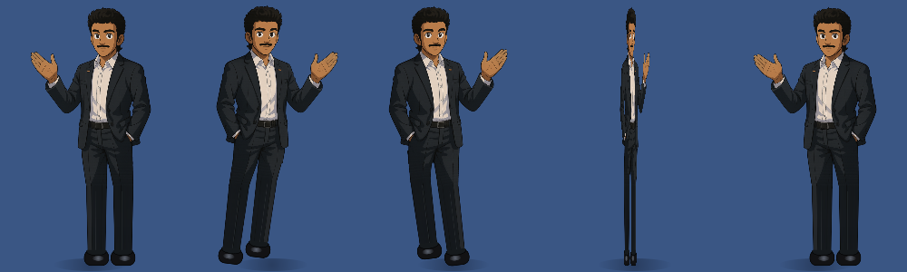
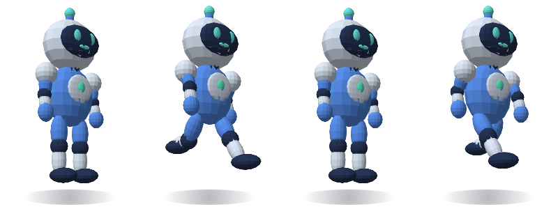

# Desktop Buddy

A small, always-on-top animated character companion for Linux, with paragraph correction,
hourly wellness reminders, and Outlook meeting reminders delivered as real desktop
notifications.

## Start

```bash
./setup.sh
./run.sh
```

### Runs automatically in the background

`./setup.sh --autostart` installs Buddy as a **systemd user service**
(`~/.config/systemd/user/desktop-buddy.service`, a copy of `desktop-buddy.service` here):

- starts automatically every time you log in, with no terminal needed
- restarts itself within 5 seconds if it ever crashes, or if the display isn't ready yet
  at login
- **right-click → Quit** stops it until your next login (or `./run.sh`)

This is already installed and enabled on this laptop.

| Task | Command |
|---|---|
| Start / restart | `./run.sh` (or `systemctl --user restart desktop-buddy`) |
| Stop | right-click → Quit, or `systemctl --user stop desktop-buddy` |
| Check it's running | `systemctl --user status desktop-buddy` |
| See its log / errors | `journalctl --user -u desktop-buddy -f` |
| Turn off autostart | `systemctl --user disable --now desktop-buddy` |

After editing the code, run `./run.sh` to restart with the changes.

## Character and controls

By default Buddy is a rigged, toon-shaded **3D model built in Blender** from
`assets/Hero_image.png`: side-swept black hair, moustache, light beard, broad shoulders, dark suit, open-collar white shirt,
belt and dress shoes. `model3d.py` plays frames rendered from it: a 16-frame walk and an
idle pose at 7 turn angles, plus a 12-frame wave at 5 angles.


To change the model, edit `blender/build_model.py` (geometry, colours, rig) or
`blender/render_frames.py` (poses). Then, in Blender's Python console:

```python
base = "/path/to/desktop-buddy/blender/"
exec(open(base + "build_model.py").read())          # rebuilds the BuddyModel collection
rf = {}; exec(open(base + "render_frames.py").read(), rf)
rf["OUT_DIR"] = "/tmp/buddy_frames"; rf["render"](rf["jobs"]())   # ~2 min
```

Finally, run `.venv/bin/python blender/pack_frames.py /tmp/buddy_frames` to rebuild
`assets/model3d/`. The saved scene is `blender/buddy_model.blend`.

**Taking a seat:** if you don't click him for 10 minutes (`SIT_AFTER` in `buddy.py`), he
pulls up a wooden chair from his right, drags it behind him and sits down, looking around
now and then. Any click, or a meeting/wellness reminder, makes him stand up and push the
chair away; a left click still opens the correction panel. This only happens with the Blender
model. The frames come from `blender/sit_frames.py` (it builds the chair and renders
pull / sit / seated at the idle angle, plus the chair as its own layer that the app slides
and fades behind him). To re-render (~1 min):

```bash
BUDDY_FRAMES=/tmp/buddy_sit blender -b blender/buddy_model.blend --python blender/sit_frames.py
.venv/bin/python blender/pack_frames.py /tmp/buddy_sit    # merges into the existing manifest
```

Right-click → **Character** also offers the illustrated artwork and Astra's simple 3D model.
The illustrated style is drawn from the original artwork (`sprite.png`, made from `assets/Hero_image.png`).
The artwork stops at the knees, so `figure.py` extends each trouser leg by stretching the
artwork's own bottom rows (keeping its shading and outline), adds dress shoes, and animates:

- walking: legs swing and the stepping foot lifts while the planted foot stays down;
  the upper body bobs and sways with each step
- turning: he narrows and flips to face the way he walks
- breathing while standing, and a waving hand (cut out at the wrist) during reminders

Only the character's own pixels catch the mouse: clicks on the empty space around him go to
the window underneath.

- **Click:** open the existing paragraph correction panel.
- **Right-click → Keep on right side:** enabled by default. Buddy stays at the
  bottom right of the primary screen's usable area, above the taskbar, taking
  occasional small steps within 36 pixels of the right edge.
- Turn docking off to let Buddy walk across the screen and enable dragging.
- **Stay here / Resume walking:** pause or resume roaming. Docking takes priority.
- **Hourly water + movement reminders:** enabled by default. Every hour while
  running, Buddy waves and asks you to drink water, stand, stretch, and walk.
- **Preview wellness reminder:** try the reminder immediately.
- Reminders wait while the correction panel is open and appear one at a time.
- Docking and wellness preferences persist across restarts. The hourly timer
  starts afresh at launch. After sleep, only one wellness reminder is shown.



3D model option: 

## Outlook meeting reminders

In Outlook on the web, open **Settings → Calendar → Shared calendars → Publish
 a calendar**, and copy the **ICS subscription link**. In Buddy, right-click →
**Connect Outlook calendar…** and paste it. Paste an empty value to disconnect.

Published calendars are readable by anyone holding their link. Only use this
option if that is appropriate for your calendar. Some organizations disable
calendar publishing. No Microsoft password is requested. This is an ICS feed
integration, not a Microsoft account sign-in or mailbox connection.

Buddy fetches the feed on launch and every five minutes; **Sync calendar now**
refreshes it immediately. The menu shows the last successful sync or an error. If a sync
fails, the meetings from the last good sync are kept, so a brief network drop doesn't
lose reminders.

### How you're reminded

Reminders start **10 minutes before** each meeting and **repeat every 2 minutes**, plus once
exactly at the start, until you press **Join meeting** (or **Open in Outlook**) or
**Dismiss**. If you haven't acknowledged by then, they keep coming for up to 10 minutes
after the start, or until the meeting ends. Closing a notification with its ✕ doesn't
count as dismissing, so it comes back at the next repeat.

Each reminder shows up in two places:

1. **Desktop notification** (GNOME banner + sound), sent over D-Bus. It's *critical*, so
   GNOME keeps it on screen, and each repeat **updates the same notification** instead of
   stacking new ones. It includes the meeting link and a **Join meeting** button.
2. **Meeting card** above Buddy with the title, time, the clickable link, **Copy link**,
   **Dismiss** and **Join meeting**. Buddy waves while it's showing.

Links are found in the invite's Teams/Google Meet/Zoom/Webex fields, location or
description. **If the invite has no link** (e.g. an in-person meeting, or one created
without Teams), the reminder says so and offers **Open in Outlook**, which opens Outlook
on the web's calendar.

Right-click → **📅 Upcoming meetings** lists what's coming: click one to join it, or to
open Outlook if it has no link. **Preview meeting reminder** shows a sample immediately.


If you see nothing: check GNOME isn't in **Do Not Disturb** (click the clock), and that
Settings → Notifications has notifications on. Buddy's own card appears regardless.

 Recurring events, recurrence exclusions, time zones, and
cancelled events are handled. All-day events are skipped. Feed publishing delays
can delay new or edited meetings. The app must be running to remind you; this is
not an alarm service while the laptop is shut down.

The URL is saved locally in Qt settings at
`~/.config/DesktopBuddy/DesktopBuddy.conf`, with owner-only file permissions.
Calendar contents are held in memory. Disconnecting clears fetched events.
See Microsoft's [calendar sharing instructions](https://support.microsoft.com/en-us/outlook/share-your-calendar-in-outlook-com).

## Paragraph correction

The existing `corrector.py` backend is unchanged:

1. Claude API with `ANTHROPIC_API_KEY` or `~/.config/desktop-buddy/api_key`.
2. Logged-in `claude` CLI.
3. LanguageTool as the fallback.

Paste a paragraph, click **Fix it** or press **Ctrl+Enter**, inspect the corrected
text and explanations, then **Copy**. Escape closes the panel. Text is sent to
the selected correction service; calendar contents are not sent for correction.

## Development and checks

- `buddy.py`: desktop window, menus, correction panel, meeting card, reminder delivery.
- `model3d.py`: the Blender model (plays the sprite strips in `assets/model3d/`).
- `blender/`: model build, render and packing scripts (`sit_frames.py`: chair + sitting), and the `.blend` file.
- `figure.py`: the illustrated character (artwork + drawn shins/shoes, walk, turn, wave).
- `avatar.py`: Astra's articulated 3D model (optional style).
- `notifier.py`: desktop notifications over D-Bus (replace-in-place, Join/Dismiss buttons,
  sound), with `notify-send` as a fallback.
- `reminders.py`: bounded background feed download, recurrence parsing, join links, timing.
- `corrector.py`: original correction backends.

```bash
PYTHONPATH=. .venv/bin/python -m unittest discover -s tests -v
QT_QPA_PLATFORM=offscreen .venv/bin/python -m py_compile buddy.py avatar.py reminders.py
```

Test coverage includes hourly timing/resume, meeting lead time and duplicate
suppression, repeating every 2 minutes until acknowledged, stopping after the grace
period, the Outlook fallback link, join-link extraction, upcoming-meeting
filtering, recurring events, exclusions, cancellation, time zones, URL
validation, and the sit/stand frame sequencing. Offscreen smoke checks cover drawing, dock placement, reminder
bubbles, and opening/closing the correction panel. The connected Outlook feed was
verified to download and parse (times converted correctly to IST), and GNOME's D-Bus
notification service was verified to show, replace and close notifications.

GNOME/Wayland uses Qt's `xcb` backend through XWayland so window positioning works.
Run `.venv/bin/python buddy.py` in a terminal to diagnose startup errors.
