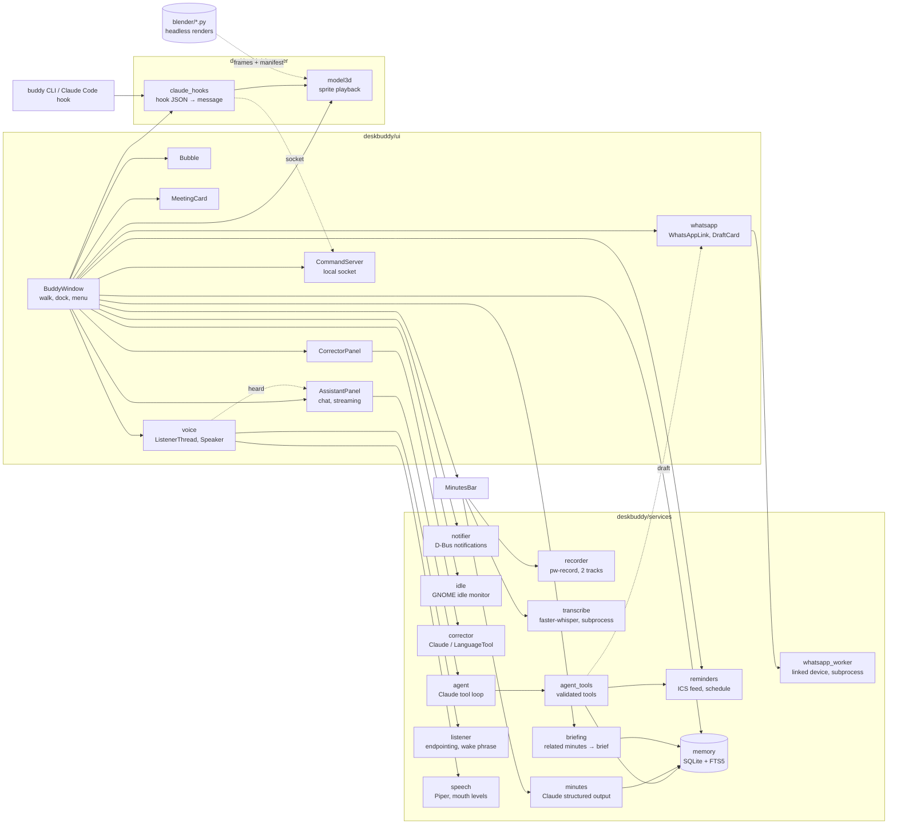

# Desktop Buddy

A small, always-on-top animated 3D companion for Linux: an **AI assistant you can talk
to** ("Hey Buddy", with spoken replies and lip-sync; Claude with tools and long-term memory) that knows your Outlook meetings, sets reminders and remembers
what you tell it, **minutes of meeting** for the calls you join, meeting reminders as real
desktop notifications, wellness nudges, and a text fixer.

## Start

```bash
./setup.sh
./run.sh
```

### Runs automatically in the background

`./setup.sh --autostart` installs Buddy as a **systemd user service**
(`~/.config/systemd/user/desktop-buddy.service`, a copy of `desktop-buddy.service` here):

- starts automatically every time you log in, with no terminal needed
- restarts itself within 5 seconds if it ever crashes, or if the display isn't ready yet
  at login
- **right-click → Quit** stops it until your next login (or `./run.sh`)

This is already installed and enabled on this laptop.

| Task | Command |
|---|---|
| Start / restart | `./run.sh` (or `systemctl --user restart desktop-buddy`) |
| Stop | right-click → Quit, or `systemctl --user stop desktop-buddy` |
| Check it's running | `systemctl --user status desktop-buddy` |
| See its log / errors | `journalctl --user -u desktop-buddy -f` |
| Turn off autostart | `systemctl --user disable --now desktop-buddy` |

After editing the code, run `./run.sh` to restart with the changes.

## Character and controls

Buddy is a rigged, toon-shaded **3D model built in Blender** from `assets/Hero_image.png`:
side-swept black hair, moustache, light beard, broad shoulders, dark suit, open-collar
white shirt, belt and dress shoes. The app plays frames pre-rendered from it: a 16-frame
walk and an idle pose at 7 turn angles, a 12-frame wave at 5 angles, and the chair sequence.


Only the character's own pixels catch the mouse: clicks on the empty space around him go to
the window underneath.

- **Click:** open **Ask Buddy** (the assistant). Right-click → **Fix text…** for the
  paragraph correction panel (also a button in the chat header).
- **Right-click → Keep on right side:** enabled by default. Buddy stays at the
  bottom right of the primary screen's usable area, above the taskbar, taking
  occasional small steps within 36 pixels of the right edge.
- Turn docking off to let Buddy walk across the screen and enable dragging.
- **Stay here / Resume walking:** pause or resume roaming. Docking takes priority.
- **Hourly water + movement reminders:** enabled by default. Every hour, Buddy waves and
  asks you to drink water, stand, stretch, and walk. **Preview wellness reminder** shows one now.
- Reminders wait while the correction panel is open and appear one at a time.
- Docking and wellness preferences persist across restarts.

### Taking a seat

If you don't click him for **10 minutes**, he pulls up a wooden chair from his right, drags
it behind him and sits down, looking around now and then. Any click, a reminder, or you
coming back to the computer makes him stand up and push the chair away (a left click still
opens the correction panel). To see it sooner: `BUDDY_SIT_AFTER=30 .venv/bin/python buddy.py`.

### Knowing when you're away

Buddy asks GNOME's idle monitor (`org.gnome.Mutter.IdleMonitor`) how long it's been since
you last used the keyboard or mouse, in *any* app. After **5 minutes** idle you count as
away: hourly break reminders are held back (no nagging an empty desk). When you come back
he gets up, says *"Welcome back! You were away 23 min."*, and since that was a break, the
next wellness reminder is an hour from then. Tune with `BUDDY_AWAY_AFTER` (seconds).

### Changing the model

Edit `blender/build_model.py` (geometry, colours, rig) or `blender/render_frames.py`
(poses). Then, in Blender's Python console:

```python
base = "/path/to/desktop-buddy/blender/"
exec(open(base + "build_model.py").read())          # rebuilds the BuddyModel collection
rf = {}; exec(open(base + "render_frames.py").read(), rf)
rf["OUT_DIR"] = "/tmp/buddy_frames"; rf["render"](rf["jobs"]())   # ~2 min
```

and run `.venv/bin/python blender/pack_frames.py /tmp/buddy_frames` to rebuild
`assets/model3d/`. The chair and sitting frames come from `blender/sit_frames.py`, which
builds the chair and renders pull / sit / seated at the idle angle, plus the chair as its own
layer that the app slides and fades behind him. It runs headless (~1 min):

```bash
BUDDY_FRAMES=/tmp/buddy_sit blender -b blender/buddy_model.blend --python blender/sit_frames.py
.venv/bin/python blender/pack_frames.py /tmp/buddy_sit    # merges into the existing manifest
```

## Ask Buddy (the assistant)

Click Buddy and ask in plain words:

- *"What's my next meeting?"* / *"Am I free after lunch?"*
- *"Remind me after the design review to email Ravi"* → fires when that meeting ends
- *"Remind me in 20 minutes to stretch"*, *"What reminders do I have?"*, *"Cancel it"*
- *"Remember that Ravi prefers Slack"* → used in later conversations; *"Forget that"*
- *"Join my next meeting"* → opens its Teams / Meet / Zoom link

He's Claude (`claude-opus-5`, adaptive thinking) with eight tools: `get_meetings`,
`create_reminder`, `list_reminders`, `cancel_reminder`, `remember`, `recall`, `forget`,
`join_meeting`. Replies stream in as they're written. **He can't** send email, read your
files, or run commands; that's deliberate.

**Setup:** save an Anthropic API key (console.anthropic.com) without it touching your
shell history or the screen:

```bash
mkdir -p ~/.config/desktop-buddy && read -rs K && printf '%s' "$K" > ~/.config/desktop-buddy/api_key \
  && chmod 600 ~/.config/desktop-buddy/api_key && unset K
```

(or set `ANTHROPIC_API_KEY`). Without a key the chat says how to connect and sends nothing.

**Memory** is a local SQLite file, `~/.local/share/desktop-buddy/memory.db` (owner-only),
holding the facts you asked him to remember and the reminders he set. Facts are found with
SQLite FTS5 full-text search (BM25 ranking, word stemming); each turn, the few that match
your message are included in the request. Reminders he sets survive restarts and fire once
through the same notification + speech bubble + wave as meeting reminders.

**What's sent to Claude:** your message, the current time, your next three meetings'
titles and times, and matching saved facts, plus whatever tools return (e.g. meeting
lists). Meeting descriptions are never sent, and invite text is treated as information,
not instructions: `join_meeting` only opens a link from your own calendar feed, looked up
by meeting key.

**Cost:** on `claude-opus-5` ($5 / $25 per million input / output tokens) a message is a
few thousand input tokens (the system prompt and tool list are prompt-cached, which cuts
repeat input cost) plus the reply and its thinking: roughly 1–3 US cents, more when he uses
several tools in one answer. Change `MODEL` in `deskbuddy/services/agent.py` to trade cost
for quality. If the model declines a
request, the API retries it on another model automatically (`fallbacks: "default"`).

## Voice: "Hey Buddy"

Say **"Hey Buddy, what's my next meeting?"** (or "Hey Buddy." … wait for **👂 Yes?** …
then ask). He answers out loud, his mouth moving with the words, and shows the reply in a
bubble; the exchange also appears in the chat. Click him to interrupt. Push-to-talk: the
🎤 button in the chat, or right-click → **Talk to Buddy**. Right-click toggles **Listen for
"Hey Buddy"** and **Speak replies**.

**Follow-ups don't need "Hey Buddy".** After he answers, he keeps listening for 10 seconds
(**👂 Anything else?**), so you can just ask the next thing. Say "thanks" or "that's all",
or stay quiet, to end the conversation.

Everything runs on this computer; nothing is sent anywhere until you've said the wake
phrase, and then only the transcribed words go to Claude.

- **Hearing:** `pw-record` streams the mic; an adaptive energy gate (it follows the room's
  noise level) cuts it into utterances; Silero VAD confirms there's speech; Whisper
  `tiny.en` checks for the wake phrase (~0.3 s); the command is transcribed with
  multilingual Whisper `base` (~0.9 s; `small` took ~2.2 s here). Wake matching tolerates
  "Heybuddy", "OK Buddy", "Hey body", but "I told my buddy" doesn't count.
- **Speaking:** Piper (`en_US-ryan-medium`, ~0.2 s to render a sentence) played with
  `pw-play`. The voice doesn't report phoneme timings, so the mouth follows loudness: four
  openings rendered in Blender (`blender/talk_frames.py`, with a strip of upper teeth),
  picked 25 times a second.
- **Not listening** while he's speaking (he'd hear himself), while recording minutes, or
  while another app is using the mic (you're on a call). If the mic stream drops (headset
  off), it reconnects by itself.
- **Cost:** ~550 MB of memory with the speech models loaded, ~5% of one core while idle.
  Turning listening off frees the CPU.

## Opening apps, folders and websites

Ask in the chat or by voice: *"Hey Buddy, open Firefox"*, *"open the calculator"*,
*"open my Downloads"*, *"open YouTube"*, *"open something I can edit photos with"*.

- **Plain "open / launch / start X"** is handled right away on this computer, without a
  Claude call (it works even without an API key): X is matched against the installed
  apps' menu entries by name, id, generic name ("web browser") and keywords, common
  nicknames ("vs code", "files", "chrome") and small typos ("calcuator"). Folder names
  (Downloads, Documents, Pictures…) and web addresses ("github.com") work too.
- **Anything vaguer** goes to the assistant, which has `list_apps`, `open_app`,
  `open_folder` and `open_website` tools, e.g. it checks what's installed before
  suggesting a photo editor, and offers the website when an app isn't installed.
- From a terminal or script: `buddy open firefox`.

**What it can open:** installed applications (from their `.desktop` entries, never an
arbitrary command), folders inside your home directory (no `../`, symlinks out, or
system folders), and http(s) addresses. Apps start in their own systemd scope, as if
opened from the dock, so they keep running when Buddy restarts.

## WhatsApp messages

*"Hey Buddy, message Ravi that I'm running 10 minutes late"*, or, after talking about
someone, just *"message him that I'll call back"*. Buddy finds the contact, writes the
message, and shows it on a card above him: **Send** / **Cancel**, or say **"yes"** / **"no"**
(typing yes/no in the chat works too). Nothing goes out until you confirm.

**Linking (once):** right-click Buddy → **Link WhatsApp…**, then on your phone open
WhatsApp → Settings → **Linked devices** → **Link a device** and scan the code. Buddy
appears there as a linked device, like WhatsApp Web; **Unlink WhatsApp** in the menu (or
removing it on the phone) logs it out.

- **How:** a helper process (`services/whatsapp_worker.py`, using
  [neonize](https://github.com/krypton-byte/neonize)/whatsmeow) holds the linked-device
  session in `~/.local/share/desktop-buddy/whatsapp.db` and gets your contact names from the
  phone. It's a separate process so it can always be stopped, and a crash in it can't take
  Buddy down.
- **Safety:** the assistant has only `find_whatsapp_contact` and `draft_whatsapp_message`:
  it can draft, never send. Contacts reach it as short keys, not numbers, so it can't
  message a number it made up. Buddy doesn't read your chats.
- **Caveat:** this is an unofficial WhatsApp client. WhatsApp doesn't offer an official
  way to automate a personal account; accounts that send a lot of automated messages can be
  flagged. Occasional messages you confirm yourself look like normal use.
- Contacts only (no groups yet). Right after linking, contacts take a minute to sync.

## Telugu

Buddy understands Telugu, English, and the mix of the two, and answers Telugu in Telugu.

- **Typing:** Telugu script or Telugu in English letters ("meeting eppudu?"): Claude reads
  both and replies in Telugu script.
- **Speaking:** the command's language is detected as it's transcribed. English goes
  through the fast model as before; Telugu (or mixed, "Firefox open cheyyi") is translated
  to English by Whisper `small` (~2.3 s, loaded on first use), and Claude is told you spoke
  Telugu, that the text is a machine translation (names may be off), and to reply in
  Telugu. Measured on Telugu speech: `base` produced gibberish; `small` got stuck
  repeating when writing Telugu script but translated accurately; `large-v3-turbo`
  mistook it for Tamil and took 10–16 s.
- **His Telugu voice:** replies in Telugu script are spoken with Piper's
  `te_IN-venkatesh-medium`; English replies keep the English voice. English words and
  numbers inside a Telugu reply are pronounced too.
- **Opening things:** "Firefox open cheyyi", "Downloads teruvu", "YouTube kholo", and in
  Telugu script "ఫైర్‌ఫాక్స్ ఓపెన్ చెయ్యి": names written in Telugu script are matched to
  apps and folders by sound (ఫైర్‌ఫాక్స్ → "phairphaaks" → consonants "frfks" = Firefox).
- **Minutes:** in a mostly-English meeting, Telugu parts come out in English letters
  ("Ravi export bugs Budawaram lopu fix chesthadu"), which keeps names and Claude reads
  well. Stretches Whisper writes in another script, or gets stuck on, are re-run as English
  translations and marked "(translated)" instead of being dropped.

*Tested with Piper's synthetic Telugu voice; a real speaker's accent may be recognized
better or worse.*

## Meeting briefings

With a meeting's first reminder (15 minutes before), Buddy looks for anything related he
already knows: minutes of earlier meetings with a similar title (recurring meetings keep
their name; generic words like "weekly" or "sync" don't count) and facts you asked him to
remember. If there's something, Claude writes one or two sentences, shown on the meeting
card (💡) and spoken if replies are on, e.g. *"Last time you promised Ravi the export fix
by Wednesday."* If there's nothing related, there's no briefing and no Claude call.
Right-click → **Brief me before meetings** turns it off.

## Claude Code and the `buddy` command

Other programs can talk to Buddy through a local socket (`$XDG_RUNTIME_DIR/desktop-buddy.sock`,
owner-only). `setup.sh` installs the `buddy` command:

```bash
buddy say "Build finished"          # bubble + wave
buddy say --speak "Tests passed"    # …and say it
buddy open firefox                  # open an app, folder or website
buddy status                        # JSON: state, voice, minutes, idle time
make test && buddy say "tests passed" || buddy say --speak "tests FAILED"
```

**Claude Code hooks** (in `~/.claude/settings.json`: `UserPromptSubmit`, `Stop` and
`Notification` all run `buddy claude-hook`) make Buddy wave and notify you when a Claude
Code task that took a minute or more finishes (*"✅ Claude Code finished · desktop-buddy:
done after 4 min"*), and whenever Claude Code is waiting for your permission or input.
He says it out loud only if you haven't touched the keyboard or mouse for 20 seconds
(you're not looking) and you're not on a call. The hook always exits 0 in ~30 ms, and does
nothing if Buddy isn't running, so it can't slow down or break Claude Code. Change the
threshold with `BUDDY_CLAUDE_LONG_TASK` (seconds); remove the hooks with `/hooks`.

### Coding by voice

*"Hey Buddy, in desktop buddy, add a dark mode to the chat panel and run the tests."* The
assistant finds the project folder (folders under your home directory with `.git`,
`package.json`, `pyproject.toml`…) and puts the task on a card: **🧑‍💻 Run with Claude
Code?**, with the folder and the task exactly as it will be sent. Nothing runs until you
say *"yes"* or click **Run**. Then VS Code opens on the folder, and Claude Code works
headless (`claude -p`, `bypassPermissions`: it can edit files and run any command). The
card lists each step (📖 reading, ✏️ editing, ▶ running…), **Stop** ends it, and Buddy
says a one-line summary when it's done. A task in the same folder within an hour
continues that session, so *"now commit it"* knows what "it" is. Also: *"open the
portfolio in VS Code"*, *"how's it going?"*. Code lives in `services/code_tasks.py` and
`ui/code_task.py`. The task runs inside Buddy's service, so restarting Buddy stops it.

## Minutes of meeting

When you join a meeting through Buddy (the card's or notification's **Join**, the meetings
menu, or asking the assistant), he asks **"📝 Take minutes for …?"**. He also asks if a
calendar meeting is on and another app (Teams, your browser…) starts using the microphone,
i.e. you joined some other way. Or right-click → **Take minutes now**. Recording only
starts on a click; a red **● Recording** bar shows the whole time. *Tell the other people
you're recording.*

1. **Record:** PipeWire's `pw-record` captures two tracks: your microphone ("You") and
   what plays through your speakers or headset ("Others"). It stops when you press
   **Stop**, 10 minutes after the meeting's scheduled end, or after 4 hours.
2. **Transcribe, on this computer:** faster-whisper's multilingual `small` model
   (~460 MB, CPU, low priority, 4 threads) handles English mixed with Telugu or Hindi.
   A 1-hour meeting takes roughly 15 minutes in the background. When your mic also picks
   up the speakers (no headset), those echoed lines are dropped, and lines that fail
   Whisper's quality limits (hallucinated repetition, silence) are removed.
3. **Write:** Claude turns the transcript into structured minutes: summary, action items
   (owner, due date), decisions, discussion, open questions. It translates non-English
   parts, fixes obvious speech-to-text slips, and doesn't invent owners or dates.
4. **Save:** `~/Documents/Meeting Minutes/<date time title>.md` with the transcript folded
   at the end. You get a notification with **Open**, and the minutes are searchable from
   the chat (*"What did we decide in the Uday meeting?"*).

**Privacy:** the audio never leaves your computer and is deleted once the minutes are
written. Only the transcript text goes to Claude. Recordings are kept under
`~/.local/share/desktop-buddy/recordings/` (owner-only) until then. If Buddy quits
mid-way, he finishes the minutes at the next start.

**Limits:** "Others" is one mixed track, so individual people are named only when the
conversation makes it clear who's speaking. Your default mic and speakers when recording
starts are used; switching devices mid-call isn't followed.

## Outlook meeting reminders

In Outlook on the web, open **Settings → Calendar → Shared calendars → Publish
 a calendar**, and copy the **ICS subscription link**. In Buddy, right-click →
**Connect Outlook calendar…** and paste it. Paste an empty value to disconnect.

Published calendars are readable by anyone holding their link. Only use this
option if that is appropriate for your calendar. Some organizations disable
calendar publishing. No Microsoft password is requested. This is an ICS feed
integration, not a Microsoft account sign-in or mailbox connection.

Buddy fetches the feed on launch and every two minutes; **Sync calendar now**
refreshes it immediately. The menu shows the last successful sync or an error. If a sync
fails, the meetings from the last good sync are kept, so a brief network drop doesn't
lose reminders. A meeting that shows up in a sync and starts within the next hour gets a
**New meeting** heads-up right away. Outlook itself can take a few minutes to publish a
meeting you just created.

### How you're reminded

Reminders start **15 minutes before** each meeting and **repeat every 2 minutes**, plus once
exactly at the start, until you press **Join meeting** (or **Open in Outlook**) or
**Dismiss**. If you haven't acknowledged by then, they keep coming for up to 10 minutes
after the start, or until the meeting ends. Closing a notification with its ✕ doesn't
count as dismissing, so it comes back at the next repeat.

Each reminder shows up in two places:

1. **Desktop notification** (GNOME banner + sound), sent over D-Bus. It's *critical*, so
   GNOME keeps it on screen, and each repeat **updates the same notification** instead of
   stacking new ones. It includes the meeting link and a **Join meeting** button.
2. **Meeting card** above Buddy with the title, time, the clickable link, **Copy link**,
   **Dismiss** and **Join meeting**. Buddy waves while it's showing.

Links are found in the invite's Teams/Google Meet/Zoom/Webex fields, location or
description. **If the invite has no link** (e.g. an in-person meeting, or one created
without Teams), the reminder says so and offers **Open in Outlook**, which opens Outlook
on the web's calendar.

Right-click → **📅 Upcoming meetings** lists what's coming: click one to join it, or to
open Outlook if it has no link. **Preview meeting reminder** shows a sample immediately.


If you see nothing: check GNOME isn't in **Do Not Disturb** (click the clock), and that
Settings → Notifications has notifications on. Buddy's own card appears regardless.

 Recurring events, recurrence exclusions, time zones, and
cancelled events are handled. All-day events are skipped. Feed publishing delays
can delay new or edited meetings. The app must be running to remind you; this is
not an alarm service while the laptop is shut down.

The URL is saved locally in Qt settings at
`~/.config/DesktopBuddy/DesktopBuddy.conf`, with owner-only file permissions.
Calendar contents are held in memory. Disconnecting clears fetched events.
See Microsoft's [calendar sharing instructions](https://support.microsoft.com/en-us/outlook/share-your-calendar-in-outlook-com).

## Paragraph correction

`deskbuddy/services/corrector.py` tries, in order:

1. Claude API with `ANTHROPIC_API_KEY` or `~/.config/desktop-buddy/api_key`.
2. Logged-in `claude` CLI.
3. LanguageTool as the fallback.

Paste a paragraph, click **Fix it** or press **Ctrl+Enter**, inspect the corrected
text and explanations, then **Copy**. Escape closes the panel. Text is sent to
the selected correction service; calendar contents are not sent for correction.

## Architecture



- **Services know nothing about widgets.** `ReminderSchedule`, `AwayTracker`, `ChairScene`,
  `MemoryStore`, `ToolBox` and `Agent` are plain Python fed with the current time (and, for
  the agent, a client), which is what makes them testable without a screen or network.
- **The agent loop is hand-written, not the SDK's tool runner**, so text can stream into
  the chat as it's generated, tool inputs can be validated before running (they stream
  eagerly, so the API doesn't validate them), and a refusal or truncated turn never runs
  its tools. History is append-only and per-turn facts ride in the user message, so the
  system prompt and tools stay a stable, cached prefix.
- **Pre-rendered 3D.** Blender renders the rigged model into sprite strips, so the app gets
  real 3D shading at the cost of a few MB of PNGs and no GPU at runtime. The chair is a
  separate layer because the character is always in front of it; in an orthographic view
  moving it is just a 2D offset, so one chair image covers the whole pull animation.
- **XWayland on purpose.** GNOME's Wayland session doesn't let apps place their own
  windows, which a desktop companion must do, so Qt runs on `xcb`. The catch, handled in
  `BuddyWindow.frozen()`: XWayland may never report the pointer leaving the window.

## Development

```
buddy.py                  launcher (the systemd service runs this)
deskbuddy/
  app.py                  QApplication, live-state dump on SIGUSR1
  config.py               tunables; timings overridable by BUDDY_* env vars
  character/              model3d.py (drawing), chair.py (sit/stand sequence)
  services/               reminders, notifier, idle, corrector,
                          agent, agent_tools, memory, recorder, transcribe,
                          minutes, listener, speech, briefing, claude_hooks
                          (no widgets)
  ipc.py, cli.py          the local socket protocol and the `buddy` command
  ui/                     buddy_window, assistant_panel, minutes_bar, voice,
                          command_server, bubble, meeting_card, corrector_panel, styles
bin/buddy                 launcher for the `buddy` command
blender/                  model build + render + pack scripts, buddy_model.blend
tests/                    pytest; test_window.py drives the real window off-screen
```

```bash
.venv/bin/pip install -r requirements-dev.txt   # pytest, pytest-qt, ruff
.venv/bin/ruff check .                          # lint
.venv/bin/pytest                                # 163 tests, ~9 s, no display, mic or network
systemctl --user kill --kill-whom=main -s USR1 desktop-buddy     # print the running buddy's state…
journalctl --user -u desktop-buddy -n 1         # …and read it
```

CI (`.github/workflows/ci.yml`) runs lint and the tests on every push.

Tests cover: reminder timing (lead time, repeats until acknowledged, grace period, resume
after sleep), recurring events, exclusions, cancellations, time zones, join-link
extraction, URL validation, the chair sequence (including reversing midway), away/return
detection and breaks, memory search/forget/reminders, every tool's input validation, the
agent loop against a fake Claude (tool round-trips, request shape, cache-stable prompts,
refusal and truncation handling), and the real window: drawing, sitting and standing, the
stale-hover fix, the chat with and without a key, and assistant reminders firing. Minutes:
echo removal, hallucination filtering, rendering, search, and the whole record → minutes
flow in the window (offer on join, offer when another app takes the mic, auto-stop,
resuming unfinished recordings, too-little-speech). Voice: wake-phrase variants and
non-wake speech, endpointing on synthetic audio (a noisy room, clicks), wake-then-command
timing, push-to-talk, speech text cleanup, mouth levels, real Piper output when installed,
and in the window: heard speech → assistant → spoken reply, standing still with the
talking mouth, and turning speech off. Copilot: hook timing per session (short tasks
stay quiet), path-safe session ids, junk input, the `buddy` command with Buddy down, say /
Claude / status messages over the real socket, related-minutes gathering, generic titles,
"NONE" briefs, and the briefing appearing on the meeting card once. Opening things: app
discovery (hidden, link and broken entries skipped), matching what people say, "open"
phrasing vs ordinary sentences, folders confined to home (symlink and `../` escapes),
web-address validation, routing, the assistant's open tools, launching in a scope, and
in the window: typed and spoken "open" without Claude, unknown apps going to Claude,
and `buddy open` over the socket.

Run `.venv/bin/python buddy.py` in a terminal to see startup errors directly.
